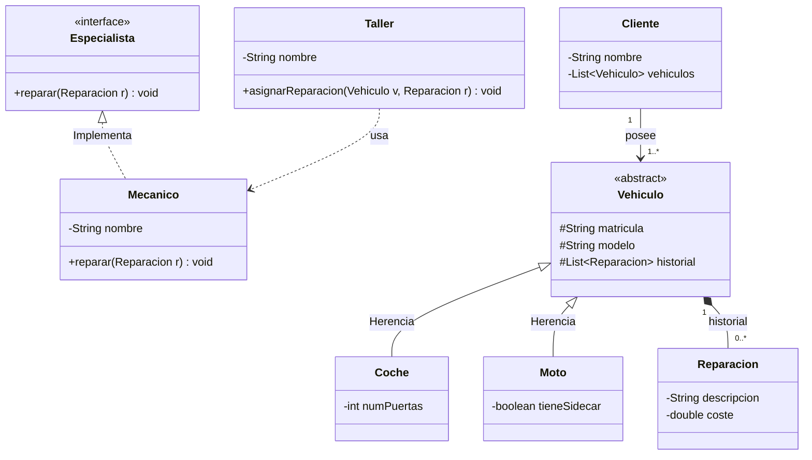
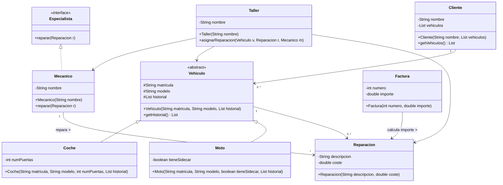

# Diagrama de Clases

```mermaid
classDiagram
    class Especialista {
        <<interface>>
        +reparar(Reparacion r) void
    }

    class Mecanico {
        -String nombre
        +reparar(Reparacion r) void
    }

    class Cliente {
        -String nombre
        -List~Vehiculo~ vehiculos
    }

    class Vehiculo {
        <<abstract>>
        #String matricula
        #String modelo
        #List~Reparacion~ historial
    }

    class Coche {
        -int numPuertas
    }

    class Moto {
        -boolean tieneSidecar
    }

    class Reparacion {
        -String descripcion
        -double coste
    }

    class Taller {
        -String nombre
        +asignarReparacion(Vehiculo v, Reparacion r) void
    }

    %% Realización
    Especialista <|.. Mecanico : Implementa

    %% Herencia
    Vehiculo <|-- Coche : Herencia
    Vehiculo <|-- Moto : Herencia

    %% Asociación Cliente → Vehiculo
    Cliente "1" --> "1..*" Vehiculo : posee

    %% Composición Vehiculo → Reparacion
    Vehiculo "1" *-- "0..*" Reparacion : historial

    %% Dependencia Taller → Mecanico
    Taller ..> Mecanico : usa
```

# Ingeniería inversa - Diagrama de Clases (Actualizado)

```mermaid
classDiagram
class Especialista {
    <<interface>>
    +reparar(Reparacion r)
}

class Mecanico {
    -String nombre
    +Mecanico(String nombre)
    +reparar(Reparacion r)
}

class Cliente {
    -String nombre
    -List<Vehiculo> vehiculos
    +Cliente(String nombre, List<Vehiculo> vehiculos)
    +getVehiculos() List<Vehiculo>
}

class Vehiculo {
    <<abstract>>
    #String matricula
    #String modelo
    #List<Reparacion> historial
    +Vehiculo(String matricula, String modelo, List<Reparacion> historial)
    +getHistorial() List<Reparacion>
}

class Coche {
    -int numPuertas
    +Coche(String matricula, String modelo, int numPuertas, List<Reparacion> historial)
}

class Moto {
    -boolean tieneSidecar
    +Moto(String matricula, String modelo, boolean tieneSidecar, List<Reparacion> historial)
}

class Reparacion {
    -String descripcion
    -double coste
    +Reparacion(String descripcion, double coste)
}

class Taller {
    -String nombre
    +Taller(String nombre)
    +asignarReparacion(Vehiculo v, Reparacion r, Mecanico m)
}

class Factura {
    -int numero
    -double importe
    +Factura(int numero, double importe)
}

%% RELACIONES

Especialista <|.. Mecanico
Vehiculo <|-- Coche
Vehiculo <|-- Moto

Cliente "1" --> "0..*" Vehiculo
Vehiculo "1" --> "0..*" Reparacion
Mecanico "1" --> "*" Reparacion : repara >
Taller --> Mecanico
Taller --> Vehiculo
Taller --> Reparacion

Factura --> Reparacion : calcula importe >
```